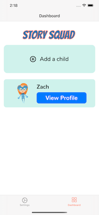

# Story Squad

1️⃣ You can find the deployed project at [🚫URL NAME GOES HERE](🚫copy and paste URL here).

## 4️⃣ Contributors

[Wilmari Rodriguez](https://github.com/kima-92) | [Jonalynn Masters](https://www.github.com/jonalynnA) | [Percival Ngan](https://github.com/PercivalN)                                     
| :-----------------------------------------------------------------------------------------------------------: | :-----------------------------------------------------------------------------------------------------------: | :-----------------------------------------------------------------------------------------------------------: | 
|             |  |  |                              
|  |              |                       |
|  |  |  |

[![Swift Version][swift-image]][swift-url]
[![Build Status][travis-image]][travis-url]
[![License][license-image]][license-url]

  

🚫 more info on using badges [here](https://github.com/badges/shields)

## Project Overview

1️⃣ [Trello Board](https://trello.com/b/YDkQ9Mqw/labs-story-squad)

1️⃣ [Product Canvas](https://www.notion.so/v1-0-Labs21-iOS-Release-Canvas-Dashboard-Integration-11d96a13125140d6b3038dc78ca02c46)

1️⃣ [UX Design files](https://www.figma.com/file/WaHXdLK2NASoFWYVMZLVNt/Story_Squad?node-id=0%3A1) 

Welcome to Story Squad! We are an interactive learning platform targeted at grade school children, and we help build reading comprehension as well as artistic, writing, and analytical/critical thinking skills through weekly competitions.

Each week features a new chapter in an exciting novel, written and serialized specifically for Story Squad by author and educator Graig Peterson. Children are provided with prompts based on the chapter they've just read, and participants are then divided into teams of two. Students create art and fanfiction to match the prompt, before going head to head in a bracket-style tournament.

In addition to growing their literary and artistic skills, students learn team building and critical thinking skills through a unique voting system, where each child must weight their own work against their teammate in order to increase their odds of winning. Badges and points incentivize winning and encourage participation.

Story Squad is a paid service; parents are required to create the account for their children and pay a monthly subscription fee in order for their children to compete. This brings the platform into compliance with COPPA and ensures a long future for the project.

### Features

-    A Custom, serialized novel geared toward students in the 3rd to 6th grade
-    Parents can create individual accounts for their children
-    The child can read and submit their own responses to the novel

## Requirements

-   iOS 13.2+
-   Xcode 11.3+
-   Cocoa Pods

## Contributing

When contributing to this repository, please first discuss the change you wish to make via issue, email, or any other method with the owners of this repository before making a change.

Please note we have a [code of conduct](./CODE_OF_CONDUCT.md). Please follow it in all your interactions with the project.

### Issue/Bug Request

    ## Contributing

When contributing to this repository, please first discuss the change you wish to make via issue, email, or any other method with the owners of this repository before making a change.

Please note we have a [code of conduct](./code_of_conduct.md). Please follow it in all your interactions with the project.

### Issue/Bug Request

 **If you are having an issue with the existing project code, please submit a bug report under the following guidelines:**
 - Check first to see if your issue has already been reported.
 - Check to see if the issue has recently been fixed by attempting to reproduce the issue using the latest master branch in the repository.
 - Create a live example of the problem.
 - Submit a detailed bug report including your environment & browser, steps to reproduce the issue, actual and expected outcomes,  where you believe the issue is originating from, and any potential solutions you have considered.

### Feature Requests

We would love to hear from you about new features which would improve this app and further the aims of our project. Please provide as much detail and information as possible to show us why you think your new feature should be implemented.

### Pull Requests

If you have developed a patch, bug fix, or new feature that would improve this app, please submit a pull request. It is best to communicate your ideas with the developers first before investing a great deal of time into a pull request to ensure that it will mesh smoothly with the project.

Remember that this project is licensed under the MIT license, and by submitting a pull request, you agree that your work will be, too.

#### Pull Request Guidelines

- Ensure any install or build dependencies are removed before the end of the layer when doing a build.
- Update the README.md with details of changes to the interface, including new plist variables, exposed ports, useful file locations and container parameters.
- Ensure that your code conforms to our existing code conventions and test coverage.
- Include the relevant issue number, if applicable.
- You may merge the Pull Request in once you have the sign-off of two other developers, or if you do not have permission to do that, you may request the second reviewer to merge it for you.

### Attribution

These contribution guidelines have been adapted from [this good-Contributing.md-template](https://gist.github.com/PurpleBooth/b24679402957c63ec426).

## Documentation

See [Backend Documentation](https://github.com/Lambda-School-Labs/story-squad-be) for details on the backend of our project.

[swift-image]: https://img.shields.io/badge/swift-3.0-orange.svg
[swift-url]: https://swift.org/
[license-image]: https://img.shields.io/badge/License-MIT-blue.svg
[license-url]: LICENSE
[travis-image]: https://img.shields.io/travis/dbader/node-datadog-metrics/master.svg?style=flat-square
[travis-url]: https://travis-ci.org/dbader/node-datadog-metrics
[codebeat-image]: https://codebeat.co/badges/c19b47ea-2f9d-45df-8458-b2d952fe9dad
[codebeat-url]: https://codebeat.co/projects/github-com-vsouza-awesomeios-com
